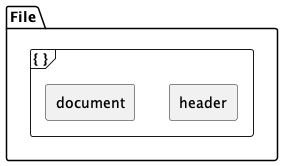
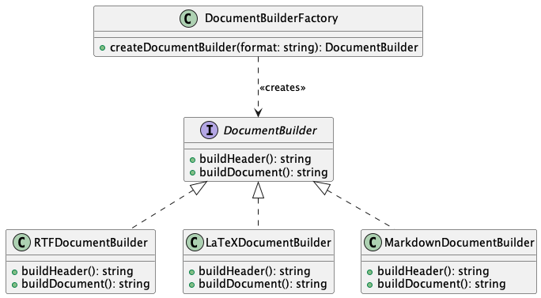
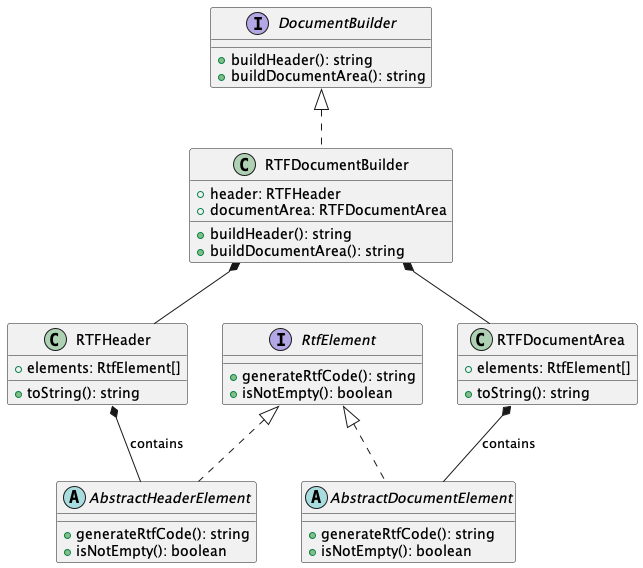

# RTF Modeling Notes

Working in Typescript, we will utilize modern practices of clean code and architecture to design a Html to Rtf converter library package. We will carefully model all parts of the RTF 1.9 specification to ensure compliance and full utilization of its functionality.

## RTF Syntax

  RTF files contain unformatted text, control words, control symbols, and groups. Standard RTF files only use 7-bit ASCII characters for ease of transport, but converters for Microsoft Word may expect 8-bit characters. There is no maximum line length for an RTF file.

  RTF uses control words as specially formatted commands to mark printer control codes and document management information. Control words are limited to 32 characters and have the following form:

> ```\LetterSequence<Delimiter>```
>
> **Note** A backslash begins each control word.

The LetterSequence is made up of lowercase alphabetic characters (a-z). RTF is case sensitive.

In RTF, backslashes and braces have special meaning. To use them as text, precede with a backslash, e.g. \\, \{, and \}. To use a backslash as text, precede with another backslash, e.g. \\. To use a backslash as a control word, precede with a space, e.g. \ \.

If a space delimits the control word, it doesn't appear in the document. Characters after the delimiter, including spaces, will appear. Use spaces only when necessary and avoid using them to break up RTF code.

## RTF Conventions

The reader of an RTF stream is concerned with the following:

- Separating control information from plain text.
- Acting on control information.
- Collecting and properly inserting text into the document, as directed by the current group state.

Controlling RTF is simple; some control info contributes special characters to plain text while other info changes the program or group state of the document.

### Contents of an RTF File

Considering these components and the requirements for various user access levels, the following approach can be taken:

1. Enhance the existing RTF models to represent the RTF header components, such as font and color tables, stylesheets, and other document settings.
1. Develop a Builder class that will act as a translator, responsible for converting the parsed HTML data and the RTF model into a suitable RTF stream.
1. Expose different levels of access to the users:
1. Simple/Defaults: Provide default templates and settings for quick and easy use.
1. Advanced: Allow users to customize the RTF metadata, styles, and elements, giving them more control over the generated RTF stream.

An RTF file or stream has the following syntax:

```<File>'{' <header> <document> '}'```



## Components Overview

We will model the RTF specification as a set of elements within each component. Each element will be modeled as a class, with the component being modeled as a builder type container class. In architecture and code we will organise elements based on our convenience. Firstly we will model the most common use cases, and itterate from there.

### Header Component

The header contains these elements:

- RTF Version: this will always be `\rtf1`.
- Character Set: default `\ansi`; dynamic based on the input HTML
- Unicode RTF: dynamic based on the input HTML.
- Font Table: index 0 default font; 1.. dynamic based on the input HTML.
- Default fonts and languages.
- Theme data: (Optional) dynamic based on the input HTML.
- File Table: (Optional) dynamic based on the input HTML.
- Color Table: default `\red0\green0\blue0`; dynamic based on the input HTML.
- Style Sheet: (Optional) dynamic based on the input HTML.
- List Table: (Optional) dynamic based on the input HTML.
- Paragraph Group Properties: (Optional) dynamic based on the input HTML.
- Revision Marks: (Optional) dynamic based on the input HTML.
- User Protection: (Optional) dynamic based on the input HTML.
- Generator: (Optional) stamp the document with its name, version, and build number.

### Document Area Components

The document area these elements:

- Information Group: (Optional) dynamic based on the input HTML (e.g. title, author, etc.); can be over-riden by the user if required.
- Read-only Password Protection: (Optional) set by the user if required.
- XML Namespace Table: (Optional) dynamic based on the input.

The next parts of the document area are the document content, and are the most complex parts of this component, and in many regards are components in their own right.

- Document Formatting: (Optional) dynamic based on the input HTML (e.g. page size, margins, etc.); can be over-riden by the user if required. 

- Mail Merge: (Not to be implemented.)

- Document Content: dynamic based on the input HTML. Settings can be over-riden by the user if required. Implements:
  - Sections Text
  - Paragraphs Text
  - Paragraph Borders & Shading
  - Revision Marks for Paragraph Numbers and ListNum Fields
  - Charater Text
  - Character Borders & Shading
  - Character Revision Marks
  - Special Characters
  - Hyphenation
  - Headers and Footers
  - Tabs
  - Bullets and Numbering
  - Positioned Objects and Frames
  - Tables
  - Mathematics
  - Highligting
  - Document Variables
  - Bookmarks
  - Pictures and Images
  - Drawing Objects (An eventual aim.)
  - Custom XML Tags and Data
  - Smart Tags
  - Footnotes and Endnotes
  - Annotations/Comments
  - Fields
  - Hyperlinks
  - Forms and Fields
  - Indexes
  - Table of Contents
  - Bidirectional Language Support
  - East Asian Language Support

## Modeling Strategies

We have already shown the RTF document/stream/file components in UML. We will now look at each component in more detail, and model the elements within each component.

### Document Builder Factory

To make the architecture uncoupled, maintainable, and easy to add other build/convert strategies such as LaTeX or Markdown, we should adhere to the SOLID design principles and use design patterns such as Strategy and Abstract Factory. 



### Components

We will use the Builder pattern to build the RTF document.



When you create an instance of RTFHeader, you can use the setColorTable() method to provide the RtfColor object. This allows the header builder to utilize the color table for building the RTF header.

```Typescript
const header = new RTFHeader();
header.setColorTable(parsedData.getColorTable());
```

## Coding Strategies by example

```typescript
// DocumentBuilder interface
interface DocumentBuilder {
  buildHeader(): string;
  buildDocument(): string;
}

// RTFHeader class
class RTFHeader {
  toString(): string {
    // Build and return the RTF header string representation
  }
}

// RTFDocumentBuilder class
class RTFDocumentBuilder implements DocumentBuilder {
  private header: RTFHeader;

  constructor() {
    this.header = new RTFHeader();
  }

  buildHeader(): string {
    return this.header.toString();
  }

  buildDocument(): string {
    // Build the document content and return the string representation
  }
}

// LaTeXDocumentBuilder class
class LaTeXDocumentBuilder implements DocumentBuilder {
  buildHeader(): string {
    // Build and return the LaTeX header string representation
  }

  buildDocument(): string {
    // Build the document content and return the string representation
  }
}

// MarkdownDocumentBuilder class
class MarkdownDocumentBuilder implements DocumentBuilder {
  buildHeader(): string {
    // Build and return the Markdown header string representation
  }

  buildDocument(): string {
    // Build the document content and return the string representation
  }
}

// DocumentBuilderFactory class
class DocumentBuilderFactory {
  createDocumentBuilder(format: string): DocumentBuilder {
    switch (format) {
      case 'rtf':
        return new RTFDocumentBuilder();
      case 'latex':
        return new LaTeXDocumentBuilder();
      case 'markdown':
        return new MarkdownDocumentBuilder();
      default:
        throw new Error(`Unsupported format: ${format}`);
    }
  }
}
```

In the RTFHeader class's build() method, we can now simply add the \rtf1 value before appending the other elements:

```typescript
interface HeaderElement {
  isNotEmpty(): boolean;
  toString(): string;
}

class RTFHeader {
  // Properties for other header elements
  private elements: HeaderElement[];

  constructor() {
    // Initialize the properties with default or empty values
    this.elements = [
      new CharacterSet(),
      new UnicodeRTF(),
      new FontTable(),
      new DefaultFontsAndLanguages(),
      new ThemeData(),
      new FileTable(),
      new ColorTable(),
      new StyleSheet(),
      new ListTable(),
      new ParagraphGroupProperties(),
      new RevisionMarks(),
      new UserProtection(),
      new Generator(),
    ];
  }

  toString(): string {
    let headerString = '{\\rtf1';

    // Conditionally append the string representations of other elements
    this.elements.forEach((element) => {
      if (element.isNotEmpty()) {
        headerString += element.toString();
      }
    });

    return headerString;
  }
}
```
## Using the facade pattern to hide complexity

Complexity of the RTF document is hidden from the end user. The end user can create a new HtmlToRtfConverter facade object and pass in the HTML string to be converted to RTF. The end user will call the convert method on the facade object which will then create the appropriate DocumentBuilder object and use it to build the RTF document.

```typescript
// HtmlToRtfConverter facade class
import {
  HtmlToRtfParser,
  DocumentBuilderFactory,
  ParsedHtmlData,
  RTFDocumentBuilder,
} from 'html-to-rtf-converter-library';

class HtmlToRtfConverter {
  private html: string;

  constructor(html: string) {
    this.html = html;
  }

  public convert(): string {
    // Create HtmlToRtfParser instance
    const htmlToRtfParser = new HtmlToRtfParser();

    // Parse the HTML input
    const parsedHtmlData: ParsedHtmlData = htmlToRtfParser.parse(this.html);

    // Create DocumentBuilderFactory instance
    const documentBuilderFactory = new DocumentBuilderFactory();

    // Create RTFDocumentBuilder instance
    const rtfDocumentBuilder: RTFDocumentBuilder = documentBuilderFactory.createDocumentBuilder('rtf') as RTFDocumentBuilder;

    // Generate RTF header and document area
    const rtfHeader = rtfDocumentBuilder.buildHeader(parsedHtmlData);
    const rtfDocumentArea = rtfDocumentBuilder.buildDocumentArea(parsedHtmlData);

    // Combine header, document area, and braces
    const rtfOutput = `{${rtfHeader}${rtfDocumentArea}}`;

    return rtfOutput;
  }
}
```

And the end user can simply use the facade class like this:

```typescript
const html = '<h1>Hello, World!</h1>';
const htmlToRtfConverter = new HtmlToRtfConverter(html);
const rtfOutput = htmlToRtfConverter.convert();

console.log(rtfOutput);
```
